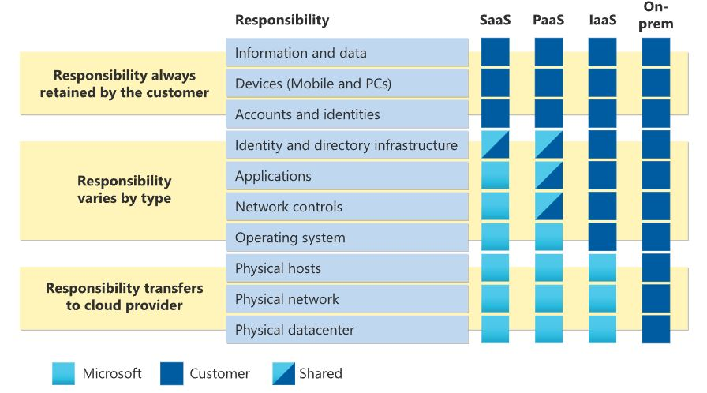

#   1.Describe cloud concepts (20-25%)
## Identify the benefits and considerations of using cloud services
### identify the benefits of cloud computing, such as High Availability, Scalability, Elasticity, Agility, and Disaster Recovery
- Cost savings - both real and accounting
- Agility
- Availability
- Security
- Global reach
- Range of ready on-demand services
- Range of tools

### identify the differences between Capital Expenditure (CapEx) and Operational Expenditure (OpEx) - doresit!!!!!!!
- CapEx is money invested in assets (like computers) that return investment over time
- OpEx is money spent every day on operating expenses

### describe the consumption-based model
- Pay per minute
- Pay per hour
- Pay per execution

## Describe the differences between categories of cloud services
### describe the shared responsibility model

### describe Infrastructure-as-a-Service (IaaS)
- Virtual machines
- networking
- load balancers
- firewalls

### describe Platform-as-a-Service (PaaS)
- Upload code packages and have them run, without access to the hardware
- Even with PaaS, you have to choose an App Service Plan
- With PaaS, scaling is your responsibility

### describe serverless computing
Serverless - There are still servers… you just don’t ever have to deal with them
- Even less access to the server than PaaS
- Serverless means not worrying about choosing the right plan
- Serverless means not worrying about scaling
- Serverless means you might pay $0 if you don’t use the service

### describe Software-as-a-Service (SaaS)
Access to configuration only

Azure Serverless Offers
- Azure Functions
- Serverless Kubernetes - ACI
- Azure SQL Database Serverless
- Cosmos DB Serverless

### identify a service type based on a use case
- prepare questions

## Describe the differences between types of cloud computing
### define cloud computing
What is cloud?

### describe Public cloud
Azure owns the hardware, on their network and infrastructure

### describe Private cloud
Looks and acts like a cloud, except customer owns or leases or has exclusive access to the hardware

### describe Hybrid cloud
Combination of public and private clouds; scale private infrastructure to the cloud
