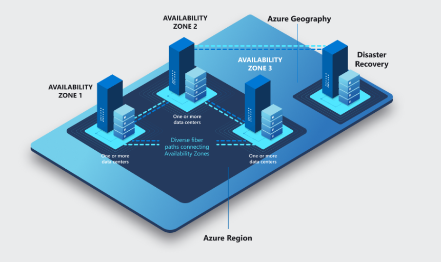
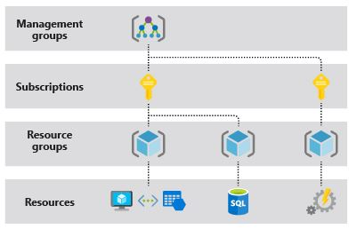

# 2. Describe core Azure Services (15-20%)
## Describe the core Azure architectural components
###  describe the benefits and usage of Regions and Region Pairs
Core Azure architectural components
Regions - 60+, dat sem aktualni obrazek datacenter

Region pairs
Each region has one other region which is treated as it’s “pair” Almost always in the same geography - data storage laws The data connection between region pairs is the highest speed available Software rollouts are deployed to one region of a pair and the other is not touched If multiple regions go down, one region of each pair is treated as a priority

Example Pairs
Canada Canada Central - Canada East
Europe North Europe - West Europe
USA East US - West US

###  describe the benefits and usage of Availability Zones

###  describe the benefits and usage of Resource Groups
A resource group is a container that holds related resources for an Azure solution.

###  describe the benefits and usage of Subscriptions
Subscription is a billing unit
Users have access to one or more subscriptions, with different roles

All resources consumed by a subscription will be billed to the owner

Can be used to organize resources into completely distinct accounts

###  describe the benefits and usage of Management Groups
Management groups provide a governance scope above subscriptions.

###  describe the benefits and usage of Azure Resource Manager
Azure Resource Manager is the deployment and management service for Azure. It provides a management layer that enables you to create, update, and delete resources in your Azure account. You use management features, like access control, locks, and tags, to secure and organize your resources after deployment.

###  explain Azure resources
VM, storage

## Describe core resources available in Azure
###  describe the benefits and usage of Virtual Machines, Azure App Services, AzureContainer Instances (ACI), Azure Kubernetes Service (AKS), and Azure Virtual Desktop
###  describe the benefits and usage of Virtual Networks, VPN Gateway, Virtual Networkpeering, and ExpressRoute
###  describe the benefits and usage of Container (Blob) Storage, Disk Storage, File Storage,and storage tiers
###  describe the benefits and usage of Cosmos DB, Azure SQL Database, Azure Database forMySQL, Azure Database for PostgreSQL, and Azure SQL Managed Instance
###  describe the benefits and usage of Azure Marketplace