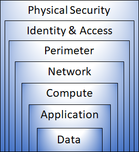

# Describe general security and network security features (10-15%)
## Describe Azure security features
### describe basic features of Microsoft Defender for Cloud, including policy compliance, security alerts, secure score, and resource hygiene
Unified infrastructure security management system that monitors and protects
your systems inside and outside of Azure
- Strengthen security
- Protect against threats
- Get secure faster

### describe the functionality and usage of Azure Key Vault
Central, secure repository for your secrets, certificates and keys

### describe the functionality and usage of Microsoft Sentinel
- Centralizes all the log files from various resources
- Analyzes them to detect threats
- Allows you to run queries on those logs yourself
- Investigate an incident
- Orchestration and automation to fix the issues
- 
### describe the functionality and usage of Azure Dedicated Hosts
Defense in Depth
Security Layers
- Data - i.e. virtual network endpoint
- Application - i.e. API Management
- Compute - i.e. Limit Remote Desktop access, Windows Update
- Network - i.e. NSG, use of subnets, deny by default
- Perimeter - i.e. DDoS, firewalls
- Identity & access - i.e. Azure AD
- Physical - i.e. Door locks and key cards

# Describe Azure network security
### describe the concept of defense in depth
The objective of defense in depth is to protect information and prevent it from being stolen by those who aren’t authorized to access it. A defense-in-depth strategy uses a series of mechanisms to slow the advance of an attack that aims at acquiring unauthorized access to data.

### describe the functionality and usage of Network Security Groups (NSG)
Defence on 4. layer

### describe the functionality and usage of Azure Firewall
Defence on 7.layer

### describe the functionality and usage of Azure DDoS protection
