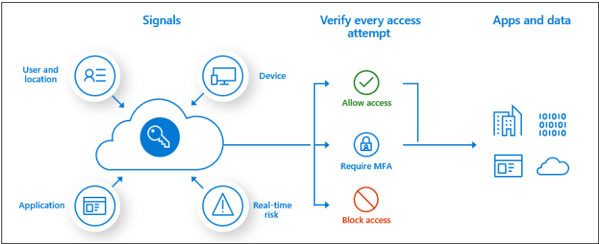

# Describe identity, governance, privacy, and compliance features (15-20%)
## Describe core Azure identity services
### explain the difference between authentication and authorization
Authentication is a user proving who they are - user id and password

Authorization is ensuring that a user is permitted to perform an action

### define Azure Active Directory
Azure Active Directory (Azure AD or AAD)

Azure Active Directory is not the same as Active Directory

Traditional AD does not work with Internet protocols

Azure AD provides “identity as a service”

Protocols:
- SAML
- OpenID
- WS Federation

### describe the functionality and usage of Conditional Access, Multi-Factor Authentication
Conditional access
Conditional Access policies at their simplest are if-then statements, if a user wants to access a resource, then they must complete an action. Example: A payroll manager wants to access the payroll application and is required to do multi-factor authentication to access it.

MFA - multifactor authentication

## Describe Azure governance features
### describe the functionality and usage of Role-Based Access Control (RBAC)
Microsoft’s preferred solution for access control

Create roles that represent the common tasks of the job

Roles:
- Owner
- Contributor
- Reader

### describe the functionality and usage of resource locks
Two types:
- Read Only
- Can Not Delete

### describe the functionality and usage of tags
Helps with billing and support issues

### describe the functionality and usage of Azure Policy
Azure Policy helps you manage and prevent IT issues with policy definitions that enforce rules and effects for your resources.

### describe the functionality and usage of Azure Blueprints
Azure Subscription templates with roles and policies already defined

### describe the Cloud Adoption Framework for Azure
Set of documentation, guidance, tools - [Link](https://docs.microsoft.com/en-us/azure/cloud-adoption-framework/)
Best practices for succeeding in the cloud

## Describe privacy and compliance resources
### describe the Microsoft core tenets of Security, Privacy, and Compliance
### describe the purpose of the Microsoft Privacy Statement, Online Services Terms (OST)
and Data Protection Amendment (DPA)
### describe the purpose of the Trust Center
### describe the purpose of the Azure compliance documentation
### describe the purpose of Azure Sovereign Regions (Azure Government cloud services and
Azure China cloud services)
